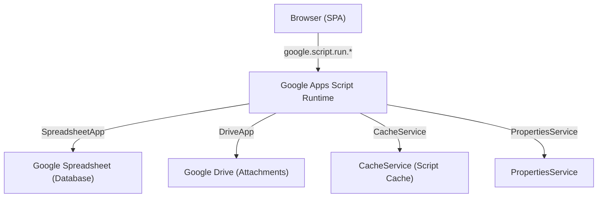

# Design Document — HabitSheet to BudgetSheet Conversion

## Overview

BudgetSheet converts the HabitSheet codebase into a personal finance tracker. The core strategy is:

- **Reuse** HabitSheet's `AuthService.gs` and `CacheService.gs` unchanged
- **Port** MoneySheet's six backend services (TransaksiService, DompetService, KategoriService, AnggaranService, LanggananService, LaporanService) as `.gs` files
- **Replace** HabitSheet's Tabler UI frontend with a glassmorphism SPA
- **Keep** the `.clasp.json` deployment config and GAS project structure

The result is a standalone Google Apps Script web app backed by a Google Spreadsheet, with no external database or server.

### Key Design Decisions

1. **Single-file GAS deployment** — All backend `.gs` files are loaded as globals by the GAS runtime. No `require()` or module bundling needed. The dependency-injection pattern from MoneySheet is preserved for testability.
2. **Glassmorphism over Tabler** — The new frontend replaces Tabler's opinionated component library with a custom glassmorphism design system built on vanilla CSS + Chart.js + Tabler Icons (icon font only).
3. **Build pipeline retained** — `build.js` bundles the multi-file frontend into a single `Index.html` for GAS deployment, same as HabitSheet.
4. **No breaking changes to auth** — `AuthService.gs` and `CacheService.gs` are copied verbatim; only `Code.gs` (the GAS entry point) is rewritten.

---

## Architecture



### Request Flow

```
User Action
  → Frontend (hash router)
    → google.script.run.functionName(args)
      → Code.gs (auth guard + dispatch)
        → Service (TransaksiService, etc.)
          → SpreadsheetHelper (batch read/write)
            → Google Spreadsheet
      → { success: true, data: ... } | { success: false, error: "..." }
    → Frontend updates DOM
```

### File Structure

```
BudgetSheet/
├── .clasp.json              # GAS deployment config (reused from HabitSheet)
├── appsscript.json          # GAS manifest
├── Code.gs                  # Entry point: doGet, setupSystem, auth guards
├── AuthService.gs           # Reused from HabitSheet (unchanged)
├── CacheService.gs          # Reused from HabitSheet (unchanged)
├── Constants.gs             # Sheet headers, column indices
├── SpreadsheetHelper.gs     # Batch read/write utilities
├── Validator.gs             # Input validation & sanitization
├── Setup.gs                 # Spreadsheet + Drive folder initialization
├── TransaksiService.gs      # Transaction CRUD + balance logic
├── DompetService.gs         # Wallet CRUD
├── KategoriService.gs       # Category CRUD
├── AnggaranService.gs       # Budget CRUD + realization calculation
├── LanggananService.gs      # Subscription CRUD + pay action
├── LaporanService.gs        # Report aggregation
├── frontend/
│   ├── index.html           # Shell HTML with glassmorphism styles
│   ├── app.js               # Hash router + AppCache
│   ├── utils/
│   │   ├── api.js           # google.script.run wrapper (Promise-based)
│   │   └── format.js        # Currency, date formatters
│   ├── components/
│   │   ├── toast.js         # Toast notification component
│   │   ├── modal.js         # Modal helper
│   │   └── charts.js        # Chart.js wrappers
│   └── pages/
│       ├── login.js
│       ├── dashboard.js
│       ├── transaksi.js
│       ├── dompet.js
│       ├── kategori.js
│       ├── anggaran.js
│       ├── langganan.js
│       ├── laporan.js
│       └── pengaturan.js
├── build.js                 # Bundles frontend → Index.html for GAS
├── dist/
│   └── Index.html           # Built output (deployed to GAS)
├── package.json
└── tests/
    ├── transaksi.unit.test.js
    ├── dompet.unit.test.js
    ├── kategori.unit.test.js
    ├── anggaran.unit.test.js
    ├── langganan.unit.test.js
    ├── laporan.unit.test.js
    ├── validator.unit.test.js
    └── budgetsheet.property.test.js
```

---

## Components and Interfaces

### Backend Components

#### Code.gs — GAS Entry Point

Replaces HabitSheet's `Code.gs`. Responsibilities:
- `doGet(e)` — serves `Index.html` (or Setup page on first run)
- `setupSystem()` — called from Setup page, delegates to `Setup.gs`
- `include(filename)` — GAS template helper
- All public API functions (auth-guarded wrappers around services)
- `serverSetAuth()` / `serverClearAuth()` — server-side session helpers

Public API functions follow the pattern from MoneySheet's `Router.js`:
```javascript
function saveTransaksi(data) {
  try {
    requireAuth(/* token from session */);
    const d = createDeps();
    const result = TransaksiService.saveTransaksi(data, d);
    _invalidateCache();
    return { success: true, data: result.data };
  } catch (e) {
    Logger.log('Error saveTransaksi: ' + e);
    return { success: false, error: e.message };
  }
}
```

#### createDeps() — Dependency Factory

Builds the `deps` object injected into all services:
```javascript
function createDeps() {
  return {
    // Constants
    TRANSAKSI_HEADERS, DOMPET_HEADERS, KATEGORI_HEADERS,
    ANGGARAN_HEADERS, LANGGANAN_HEADERS, TRANSAKSI_KATEGORI_IDX,
    // Services
    SpreadsheetHelper, Validator, DompetService, TransaksiService,
    KategoriService, AnggaranService, LanggananService,
    // Sheet accessor
    getSheet(sheetName) {
      const ssId = PropertiesService.getScriptProperties().getProperty('SPREADSHEET_ID');
      return SpreadsheetApp.openById(ssId).getSheetByName(sheetName);
    }
  };
}
```

#### Authentication Flow

BudgetSheet uses a hybrid auth approach combining HabitSheet's `AuthService.gs` (password + session token) with MoneySheet's server-side `CacheService.getUserCache()` session:

1. User submits password → `login(password)` → returns `{ token, mustChangePassword }`
2. Frontend stores token in `localStorage`
3. Each API call passes token as last argument → `requireAuth(token)` validates it
4. `serverSetAuth()` sets a 1-hour server-side cache flag for `doGet` preloading

### Frontend Components

#### Hash Router (app.js)

```javascript
const routes = {
  '/dashboard':  () => renderDashboard(),
  '/transaksi':  () => renderTransaksi(),
  '/dompet':     () => renderDompet(),
  '/kategori':   () => renderKategori(),
  '/anggaran':   () => renderAnggaran(),
  '/langganan':  () => renderLangganan(),
  '/laporan':    () => renderLaporan(),
  '/pengaturan': () => renderPengaturan(),
};
```

#### AppCache (app.js)

In-memory + localStorage cache for rarely-changing data:
- `AppCache.getKategori()` — categories
- `AppCache.getDompet()` — wallets
- `AppCache.invalidate(key)` — called after any mutation

#### api.js — Backend Bridge

Wraps `google.script.run` in Promises:
```javascript
function callBackend(fnName, ...args) {
  return new Promise((resolve, reject) => {
    google.script.run
      .withSuccessHandler(resolve)
      .withFailureHandler(reject)
      [fnName](...args);
  });
}
```

---

## Data Models

### Spreadsheet Sheets

#### Transactions (Transaksi)
| Column | Type | Description |
|--------|------|-------------|
| ID | string | `trx-{timestamp}-{random}` |
| Tanggal | date string | ISO date `YYYY-MM-DD` |
| Jenis | string | `Pemasukan` \| `Pengeluaran` \| `Transfer` |
| Jumlah | number | Positive amount |
| KategoriID | string | FK → Kategori.ID (empty for Transfer) |
| DompetAsalID | string | FK → Dompet.ID |
| DompetTujuanID | string | FK → Dompet.ID (Transfer only) |
| Catatan | string | User notes |
| URLLampiran | string | Google Drive file URL |

#### Wallets (Dompet)
| Column | Type | Description |
|--------|------|-------------|
| ID | string | `dompet-{timestamp}-{random}` |
| Nama | string | Wallet name |
| SaldoAwal | number | Initial balance |
| SaldoSaatIni | number | Current balance (updated on each transaction) |
| Ikon | string | Tabler Icon name (e.g. `wallet`) |
| Warna | string | Hex color code |
| TanggalDibuat | date string | ISO date |

#### Categories (Kategori)
| Column | Type | Description |
|--------|------|-------------|
| ID | string | `kategori-{timestamp}-{random}` |
| Nama | string | Category name |
| Jenis | string | `Pemasukan` \| `Pengeluaran` \| `Keduanya` |
| Ikon | string | Tabler Icon name |
| Warna | string | Hex color code |

#### Budgets (Anggaran)
| Column | Type | Description |
|--------|------|-------------|
| ID | string | `anggaran-{timestamp}-{random}` |
| KategoriID | string | FK → Kategori.ID |
| JumlahAnggaran | number | Budget limit |
| Periode | string | `Bulanan` \| `Mingguan` \| `Tahunan` |
| Bulan | number | 1–12 (for monthly budgets) |
| Tahun | number | 4-digit year |

#### Subscriptions (Langganan)
| Column | Type | Description |
|--------|------|-------------|
| ID | string | `langganan-{timestamp}-{random}` |
| Nama | string | Subscription name |
| Jumlah | number | Amount per period |
| KategoriID | string | FK → Kategori.ID |
| DompetID | string | FK → Dompet.ID |
| Frekuensi | string | `Harian` \| `Mingguan` \| `Bulanan` \| `Tahunan` |
| TanggalJatuhTempo | date string | Next due date |
| Catatan | string | Notes |
| Status | string | `Aktif` \| `Nonaktif` |

### Frontend State Model

```javascript
// AppCache (in-memory + localStorage)
{
  kategori: Category[],   // null = not loaded
  dompet:   Wallet[],     // null = not loaded
}

// Page-local state (per render function)
{
  transaksi: { items: Transaction[], total: number, offset: number },
  dashboard: DashboardData,
  laporan:   ReportData,
}
```

### Glassmorphism Design Tokens

```css
:root {
  /* Gradient background */
  --bg-gradient: linear-gradient(135deg, #A8D8EA 0%, #C9B8E8 50%, #B8E8D4 100%);

  /* Frosted glass surfaces */
  --glass-bg: rgba(255, 255, 255, 0.25);
  --glass-bg-hover: rgba(255, 255, 255, 0.35);
  --glass-border: rgba(255, 255, 255, 0.4);
  --glass-blur: blur(12px);
  --glass-shadow: 0 8px 32px rgba(31, 38, 135, 0.15);

  /* Border radius */
  --radius-card: 16px;
  --radius-btn: 12px;
  --radius-input: 10px;

  /* Typography */
  --font-base: 16px;
  --font-heading: 24px;
  --font-small: 14px;

  /* Status colors (pastel) */
  --color-success: #6BCB77;
  --color-warning: #FFD166;
  --color-danger: #EF6C6C;
  --color-info: #74B9FF;
}
```

---

## Correctness Properties

*A property is a characteristic or behavior that should hold true across all valid executions of a system — essentially, a formal statement about what the system should do. Properties serve as the bridge between human-readable specifications and machine-verifiable correctness guarantees.*

### Property 1: Setup idempotency

*For any* number of calls to `setupApp()` greater than or equal to 1, the resulting spreadsheet ID and Drive folder ID stored in PropertiesService SHALL be identical to those created on the first call.

**Validates: Requirements 1.4**

---

### Property 2: Transaction balance delta — Income

*For any* positive amount and wallet ID, calling `hitungDeltaSaldo('Pemasukan', amount, walletId)` SHALL return exactly one delta entry `{ id: walletId, delta: +amount }`.

**Validates: Requirements 2.3**

---

### Property 3: Transaction balance delta — Expense

*For any* positive amount and wallet ID, calling `hitungDeltaSaldo('Pengeluaran', amount, walletId)` SHALL return exactly one delta entry `{ id: walletId, delta: -amount }`.

**Validates: Requirements 2.4**

---

### Property 4: Transaction balance delta — Transfer

*For any* positive amount, source wallet ID, and destination wallet ID, calling `hitungDeltaSaldo('Transfer', amount, srcId, dstId)` SHALL return exactly two delta entries: `{ id: srcId, delta: -amount }` and `{ id: dstId, delta: +amount }`.

**Validates: Requirements 2.2**

---

### Property 5: Transaction save round-trip

*For any* valid transaction data object, calling `saveTransaksi(data, deps)` followed by `getTransaksi({}, 0, 100, deps)` SHALL return a result set that contains an item with matching `tanggal`, `jenis`, `jumlah`, `kategoriId`, and `dompetAsalId`.

**Validates: Requirements 2.1**

---

### Property 6: Transaction delete reverses balance

*For any* transaction that has been saved, deleting it via `deleteTransaksi(id, deps)` SHALL leave every affected wallet's `SaldoSaatIni` equal to its value before the transaction was saved.

**Validates: Requirements 2.7**

---

### Property 7: Wallet creation sets current balance equal to initial balance

*For any* positive initial balance value, calling `saveDompet({ nama, saldoAwal: amount, ... }, deps)` SHALL produce a wallet where `SaldoSaatIni === SaldoAwal === amount`.

**Validates: Requirements 3.2**

---

### Property 8: Wallet update preserves balance

*For any* wallet with any current balance, calling `saveDompet({ id, nama: newName, ikon, warna }, deps)` (update path) SHALL leave `SaldoSaatIni` unchanged.

**Validates: Requirements 3.3**

---

### Property 9: Input validation rejects non-positive amounts

*For any* value that is not a strictly positive number (zero, negative, NaN, null, empty string), calling `validateJumlah(value)` SHALL throw an error.

**Validates: Requirements 2.8, 5.2**

---

### Property 10: Input sanitization neutralizes formula injection

*For any* string whose first character is one of `=`, `+`, `-`, `@`, calling `sanitizeString(str)` SHALL return a string whose first character is `'` (single quote), making it safe for spreadsheet storage.

**Validates: Requirements 11.2**

---

### Property 11: Budget status thresholds

*For any* actual expense amount and budget amount where `actual / budget >= 1.0`, `hitungStatusAnggaran(actual, budget)` SHALL return `'kritis'`. *For any* pair where `0.8 <= actual / budget < 1.0`, it SHALL return `'peringatan'`. *For any* pair where `actual / budget < 0.8`, it SHALL return `'normal'`.

**Validates: Requirements 5.5, 5.6**

---

### Property 12: Budget realization calculation

*For any* set of transactions and a given category ID, month, and year, `hitungRealisasi(kategoriId, bulan, tahun, rows, idx)` SHALL return the exact sum of `Jumlah` for all rows where `Jenis === 'Pengeluaran'`, `KategoriID === kategoriId`, and the transaction date falls within the specified month and year.

**Validates: Requirements 5.3**

---

### Property 13: Subscription due date advance

*For any* subscription with a valid `TanggalJatuhTempo` and `Frekuensi`, calling `hitungDueDateBerikutnya(tanggal, frekuensi)` SHALL return a date strictly after the input date, advanced by exactly the period corresponding to the frequency (1 day / 7 days / 1 month / 1 year).

**Validates: Requirements 6.3**

---

### Property 14: Subscription warning threshold

*For any* due date and reference date where the difference is less than or equal to 3 days (including past-due), `hitungStatusLangganan(dueDate, today)` SHALL return `true`. *For any* pair where the difference is greater than 3 days, it SHALL return `false`.

**Validates: Requirements 6.5**

---

### Property 15: Report net balance identity

*For any* set of transactions, `getLaporanData(filter, deps)` SHALL satisfy the invariant: `saldoBersih === totalPemasukan - totalPengeluaran`.

**Validates: Requirements 9.2**

---

### Property 16: Transaction filter correctness

*For any* dataset of transactions and any filter object (date range, kategoriId, dompetId, jenis, q), every item returned by `getTransaksi(filter, 0, 9999, deps)` SHALL satisfy all non-empty filter criteria simultaneously.

**Validates: Requirements 8.4**

---

### Property 17: Pagination slice correctness

*For any* dataset of N transactions, `getTransaksi({}, offset, limit, deps)` SHALL return exactly `min(limit, max(0, N - offset))` items, and those items SHALL correspond to the correct positional slice of the full dataset.

**Validates: Requirements 12.3**

---

## Error Handling

### Backend Error Strategy

All public functions in `Code.gs` wrap service calls in try/catch and return a uniform response envelope:

```javascript
// Success
{ success: true, data: <result> }

// Failure
{ success: false, error: "<human-readable message>" }
```

Internal errors are logged via `Logger.log()` before returning the generic envelope. Stack traces and internal details are never exposed to the frontend.

### Validation Errors

`Validator.gs` throws `Error` with descriptive messages for:
- Non-positive amounts → `"Jumlah harus berupa angka positif"`
- Invalid transaction type → `"Jenis transaksi tidak valid..."`
- Missing required fields → `"[Field] harus diisi"`
- Formula injection characters → sanitized silently (no error thrown)

### Frontend Error Strategy

```javascript
// api.js pattern
callBackend('saveTransaksi', data)
  .then(res => {
    if (!res.success) { showToast(res.error, 'error'); return; }
    showToast('Transaksi berhasil disimpan', 'success');
    closeModal();
    refreshCurrentPage();
  })
  .catch(err => showToast('Terjadi kesalahan. Coba lagi.', 'error'));
```

Toast notifications auto-close after 5 seconds. Loading spinners are shown on the triggering element during async operations.

### Edge Cases

| Scenario | Handling |
|----------|----------|
| Wallet not found during transaction | Error thrown by `DompetService.updateSaldoDompet`, caught by Code.gs, returned as `{ success: false }` |
| Expense causes negative balance | Transaction saved with a `warning` field; frontend shows amber toast |
| Delete wallet with transactions | `deleteDompet` throws before any deletion; balance unchanged |
| Delete category with transactions | `deleteKategori` throws before any deletion |
| Spreadsheet not initialized | `doGet` redirects to Setup page |
| Session expired | `requireAuth` throws `UNAUTHORIZED`; frontend redirects to login |

---

## Testing Strategy

### Overview

Testing uses Jest (Node.js) with dependency injection — no GAS runtime required. The same DI pattern used in MoneySheet is preserved: all services accept a `deps` object, making them fully testable with mock sheets.

### Test Types

**Unit tests** — specific examples and edge cases for each service:
- `transaksi.unit.test.js` — CRUD operations, balance updates, filter logic
- `dompet.unit.test.js` — wallet creation, update, delete guard
- `kategori.unit.test.js` — category CRUD, delete guard
- `anggaran.unit.test.js` — budget CRUD, realization calculation
- `langganan.unit.test.js` — subscription CRUD, pay action, due date advance
- `laporan.unit.test.js` — report aggregation, period grouping
- `validator.unit.test.js` — all validation and sanitization functions

**Property-based tests** — `budgetsheet.property.test.js` using [fast-check](https://github.com/dubzzz/fast-check):
- Minimum 100 iterations per property
- Each test tagged with: `// Feature: habitsheet-to-budgetsheet-conversion, Property N: <text>`
- Generators produce random but valid domain objects (transactions, wallets, categories, etc.)

### Property Test Configuration

```javascript
// jest.config.js
module.exports = {
  testEnvironment: 'node',
  testMatch: ['**/tests/**/*.test.js'],
};

// budgetsheet.property.test.js
const fc = require('fast-check');

// Feature: habitsheet-to-budgetsheet-conversion, Property 2: Transaction balance delta — Income
test('hitungDeltaSaldo Income: delta is +amount for source wallet', () => {
  fc.assert(
    fc.property(
      fc.float({ min: 0.01, max: 1e9, noNaN: true }),
      fc.string({ minLength: 1 }),
      (amount, walletId) => {
        const deltas = hitungDeltaSaldo('Pemasukan', amount, walletId);
        expect(deltas).toHaveLength(1);
        expect(deltas[0]).toEqual({ id: walletId, delta: amount });
      }
    ),
    { numRuns: 100 }
  );
});
```

### Mock Sheet Pattern

```javascript
function makeMockSheet(rows = []) {
  const data = [headers, ...rows];
  return {
    getDataRange: () => ({ getValues: () => JSON.parse(JSON.stringify(data)) }),
    appendRow: (row) => data.push(row),
    getRange: (r, c, nr, nc) => ({
      setValues: ([row]) => { data[r - 1] = row; }
    }),
    deleteRow: (r) => data.splice(r - 1, 1),
    getLastRow: () => data.length,
  };
}
```

### Coverage Targets

| Layer | Target |
|-------|--------|
| Pure functions (hitungDeltaSaldo, hitungStatusAnggaran, etc.) | 100% |
| Service CRUD (save/get/delete) | ≥ 90% |
| Validator | 100% |
| Frontend (manual + smoke) | Key flows |
