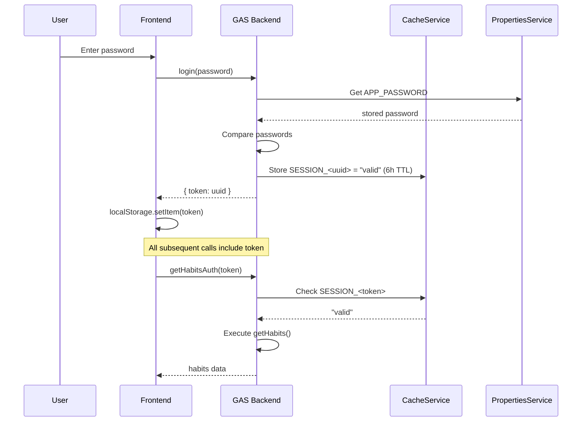

# HabitSheet Authentication Implementation

## Summary
Added a complete password-based authentication system to the HabitSheet app, following the same pattern used in MoneySheet but adapted for the simpler GAS project structure.

## Changes Made

### [NEW] [AuthService.gs](file:///home/adi/Adi/App/Codes/gas/HabitSheet/AuthService.gs)
Backend authentication service providing:
- **`login(password)`** — Validates password against `PropertiesService`, returns a UUID session token stored in `CacheService` (6-hour TTL)
- **`validateSession(token)`** — Checks if a session token is still valid
- **`logout(token)`** — Removes session from cache
- **`changePassword(oldPassword, newPassword, token)`** — Auth-guarded password change
- **`requireAuth(token)`** — Guard function that throws `'UNAUTHORIZED'` if token is invalid

---

### [NEW] [Login.html](file:///home/adi/Adi/App/Codes/gas/HabitSheet/Login.html)
Beautiful login screen with:
- Glassmorphism card design with green gradient branding (matching HabitSheet's identity)
- Password input with show/hide toggle
- Loading spinner during verification
- Error display with shake animation
- Default password hint (`admin123`)
- Auth token stored in `localStorage` for session persistence

---

### [MODIFY] [Code.gs](file:///home/adi/Adi/App/Codes/gas/HabitSheet/Code.gs)
- Added `doGet()` entry point for web app deployment
- Removed dead `Users` sheet initialization (was never used)
- Created auth-wrapped versions of all CRUD functions:
  | Protected Function | Delegates To |
  |---|---|
  | `getHabitsAuth(token)` | `getHabits()` |
  | `createHabitAuth(data, token)` | `createHabit(data)` |
  | `updateHabitAuth(id, data, token)` | `updateHabit(id, data)` |
  | `deleteHabitAuth(id, token)` | `deleteHabit(id)` |
  | `getAllCompletionsAuth(start, end, token)` | `getAllCompletions(start, end)` |
  | `toggleCompletionAuth(id, date, token)` | `toggleCompletion(id, date)` |
  | `calculateStreakAuth(id, token)` | `calculateStreak(id)` |
  | `reorderHabitsAuth(ids, token)` | `reorderHabits(ids)` |

---

### [MODIFY] [Index.html](file:///home/adi/Adi/App/Codes/gas/HabitSheet/Index.html)
- Added `<?!= include('Login'); ?>` to render login screen
- Main content and alert container hidden by default (`display: none`)
- Login screen shown first; main content revealed only after successful authentication

---

### [MODIFY] [App.html](file:///home/adi/Adi/App/Codes/gas/HabitSheet/App.html)
- **Auto-login**: On page load, validates stored token via `validateSession()`. If valid → skips login. If expired → shows login screen.
- **All backend calls** now pass the auth token as the last parameter and use the `*Auth` function variants
- **Auth error handling**: `handleAuthError()` detects `'UNAUTHORIZED'` errors and redirects to login
- **Logout button** added to all page headers (overview, calendar, statistics)
- **Password change form** added to Settings modal (new "Keamanan" tab)
- **XSS protection**: Added `escapeHtml()` function; all user-generated content (habit names) is sanitized before rendering in `innerHTML`

## Security Architecture

## What Was Not Changed
- **`appsscript.json`** — `"access": "ANYONE"` is kept intentionally because the password gate provides the auth layer. Changing to `ANYONE_WITH_GOOGLE_ACCOUNT` would add an extra Google login on top, which may be desired but wasn't requested.
- **`HabitService.gs`**, **`CompletionService.gs`**, **`SampleData.gs`**, **`Styles.html`** — Untouched. The internal functions remain as-is; they're now only reachable through auth-guarded wrappers.

## Default Credentials
- **Password**: `admin123`
- Can be changed via Settings → Keamanan → Ubah Password
